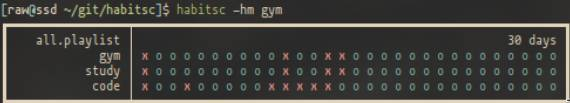

# HABITS CLI



Finally, a habit tracker that isn't bloated and that can be printed at terminal startup! 

## Install
```bash
git clone https://github.com/vascoalvesxyz/habitsc.git 
cd habitsc
make
```

**The binary is copied to ./local/bin, if you don't have this folder added to $PATH copy habitsc to /usr/bin !!!**.

### Configuration

config.h has some options you can change if you need to.

You need to run make again to apply the changes (duh).


## Example Use:

```bash
habitsc _n_            # Shows last _n_ days for all habits. Defaults to 30. 

habitsc 365 | less      # Show last 365 days for all habits. 

habitsc -ha code        # creates habit code

habitsc -hm code        # marks/unmarks code as done for today

habitsc -hs code _n_    # shows last _n_ days just for code

habitsc -hd code        # deletes habid code
```

### Playlist Commands

```bash
habitsc -pc important       # creates playlist "important"

habitsc -pa important code  # adds code to important

habitsc -pr important code  # removes code from important

habitsc -ps important _n_   # shows last _n_ days just for code

habitsc -pd important       # deletes playlist important 
```

## Todo
- List playlists.
- Change habit order in playlist.
- Mark/unmark date at earlier day.
